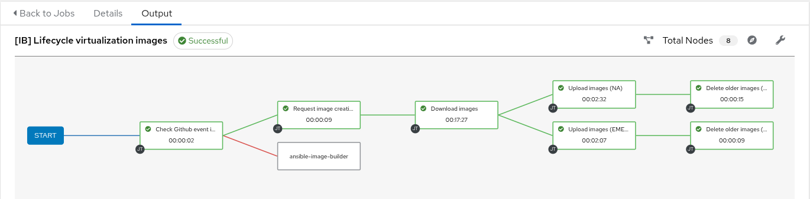

# ansible-image-builder
A collection of Ansible playbooks to manage lifecycle of virtualization images using declarative image definitions through the [API interface](https://developers.redhat.com/api-catalog/api/image-builder) of Red Hat's [Insights Image Builder](https://console.redhat.com/insights/image-builder).

- [ansible-image-builder](#ansible-image-builder)
  - [Prerequisites](#prerequisites)
  - [Configuration](#configuration)
  - [Image types](#image-types)
    - [Downloadable images](#downloadable-images)
    - [Pushable images](#pushable-images)
  - [Creating image definitions](#creating-image-definitions)
    - [Image Builder customizations](#image-builder-customizations)
    - [Offline customizations](#offline-customizations)
    - [Sharing images with cloud providers](#sharing-images-with-cloud-providers)
      - [Amazon Web Services](#amazon-web-services)
      - [Azure](#azure)
      - [Google Cloud Platform](#google-cloud-platform)
  - [Setting a release id](#setting-a-release-id)
  - [Example playbooks](#example-playbooks)
    - [Playbooks to run from command line](#playbooks-to-run-from-command-line)
      - [create-and-download.yaml](#create-and-downloadyaml)
      - [lifecycle-images.yaml](#lifecycle-imagesyaml)
      - [list-distributions.yaml](#list-distributionsyaml)
      - [list-composes.yaml](#list-composesyaml)
      - [get-compose-details.yaml](#get-compose-detailsyaml)
      - [cleanup-composes.yaml](#cleanup-composesyaml)
    - [Playbooks to create a workflow in Ansible Automation Platform](#playbooks-to-create-a-workflow-in-ansible-automation-platform)


## Prerequisites
To use this Ansible role and run the playbooks in this repository you need:
1. A user account on Red Hat's customer portal
2. An offline token, which you can generate [here](https://access.redhat.com/management/api)
3. Somewhere to run ansible-playbooks, such as Ansible Automation Platform or otherwise through command line
4. Optionally: A private cloud (such as OpenStack) where to upload and rotate the images, or a tenant in a cloud provider where to share the images.

## Configuration
1. clone this repository to your Ansible server of choice:
```
$ git clone https://github.com/enothen/ansible-image-builder
$ cd ansible-image-builder
```

2. Create and populate a vault (then put your vault password in a file or provide on the ansible-playbook command line):
```
$ echo 'vault_offline_token: "<your offline token here>"' > group_vars/all/vault
$ ansible-vault encrypt group_vars/all/vault
```

3. If uploading images to OpenStack, install the `python3-openstackclient` (eg: in a venv)
```
$ python3 -m venv ~/venvs/ImageBuilder
$ source ~/venvs/ImageBuilder/bin/activate
$ pip install --upgrade pip python-openstackclient
```

## Image types
Insights image builder supports different types of images, which can be classified in two groups: the ones you can download, and the ones you can push to public cloud providers.
You can use `ansible-image-builder` to build all of the image types supported by Insights Image Builder.

### Downloadable images
This type of images are copied to an AWS S3 bucket after the build completes successfully, so that they can be downloaded to be used in private clouds, virtualization environments, etc.
- edge-commit
- edge-installer
- guest-image
- rhel-edge-commit
- rhel-edge-installer
The actual file format depends on the image type. For example, the `guest-image` type will create a `.qcow2` file, and the `vsphere` type will create a `.vmdk` file. The list of all extensions matching the image types are defined [here](https://github.com/enothen/ansible-image-builder/blob/main/roles/image_builder/vars/main.yaml#L7-L17).

### Pushable images
This type of images are build for a public cloud provider, and pushed to a specified environment after the build completes successfully, which means the image definition may require parameters such as tenant, subscription, resource group, etc. See [examples/main.yaml](examples/main.yaml) for more details.
- ami
- aws
- azure
- gcp
- oci
- vhd

## Creating image definitions
Create image definitions in yaml, where the `images` variable contains an array of images to manage. Each of the entries is a dictionary with the following format:

```
  - name: String (max 100 char, required)
    distribution: String, limited to specific options, required
    description: String (max 250 char), optional
    customizations: Object<Customizations>, optional
```

The schema of the ComposeRequest and Customizations objects, as well as the rest of all possible customizations are defined [here](https://developers.redhat.com/api-catalog/api/image-builder#content-schemas).

Unless overriden in the image definition, the `image_type` defaults to `guest-image` and the `architecture` to `x86_64`.

### Image Builder customizations
There are multiple customization methods available, all of them with their own restrictions. Some examples are:

- **filesystems**: ISO and OSTree images don't support filesystems. If you have a customization of type `filesystem` and a type of `edge-installer` or `edge-commit`, the compose request is going to be rejected. See valid image types for Insights Image Builder [here](https://developers.redhat.com/api-catalog/api/image-builder#schema-ImageTypes), and documentation of image types [here](https://docs.redhat.com/en/documentation/red_hat_enterprise_linux/9/html-single/composing_a_customized_rhel_system_image/index#specifying-a-custom-filesystem-configuration_creating-system-images-with-composer-command-line-interface).
- **directories**: You can define new directories or directory structures and define the user, password and mode of the directory, as long as the directory's path is under /etc. If you add directories outside of /etc, the image build request is going to be accepted, but the build is going to fail. This is documented [here](https://access.redhat.com/documentation/en-us/red_hat_enterprise_linux/9/html/composing_a_customized_rhel_system_image/creating-system-images-with-composer-command-line-interface_composing-a-customized-rhel-system-image#specifying_customized_directories_in_the_blueprint).
- **firewall**: Sligthly different to what the `firewall-cmd --add-port` command expects, adding ports to the firewall in image builder is done with the `:` separator, therefore a list of `<port>:<protocol>` is required. This is documented [here](https://access.redhat.com/documentation/en-us/red_hat_enterprise_linux/9/html/composing_a_customized_rhel_system_image/creating-system-images-with-composer-command-line-interface_composing-a-customized-rhel-system-image#customizing-firewall_creating-system-images-with-composer-command-line-interface).
- **Implicit dependencies**: When adding any customization of type firewall (either ports or services), the firewalld package must also be explicitly added to the list of packages to install, or the image build would fail because the command `firewall-offline-cmd` is not available on the image. Idealy, you would also list `firewalld` on the enabled section of the services customization, in order for the service to start at boot.
- **image type restrictions**: Some customization methods are not supported in combination with specific image types. For example, the image types `rhel-edge-commit` and `rhel-edge-installer` don't support the `kernel` customization method.

Here's a definition example: a RHEL 9.2 image that installs Apache, MariaDB and PHP, customizing firewall, services and filesystems:
```
images:
  - name: rhel-9.2-lamp
    distribution: rhel-92
    description: "RHEL 9.2 with Apache, MariaDB and PHP"
    customizations:
      files:
        - path: /etc/sudoers.d/dbagroup
          mode: '0600'
          user: root
          group: root
          data: |
            # Sudo rules for database administrators
            %dbas ALL= /usr/bin/systemctl start mysqld.service
            %dbas ALL= /usr/bin/systemctl stop mysqld.service
            %dbas ALL= /usr/bin/systemctl restart mysqld.service
            %dbas ALL= /usr/bin/systemctl reload mysqld.service
      firewall:
        services:
          enabled:
            - ssh
            - http
            - https
      filesystems:
        - mountpoint: /var/www/html
          min_size: 2048
        - mountpoint: /var/lib/mysql
          min_size: 2048
      packages:
        - httpd
        - mariadb-server
        - php
        - php-mysqlnd
      services:
        enabled:
          - firewalld
          - httpd
          - mariadb
```
See more advanced example definitions, including other image formats, architectures and customizations in [examples/main.yaml](examples/main.yaml).

### Offline customizations
It is possible to further customize images after they are downloaded, using the libguestfs `virt-customize` and `virt-edit` commands. To run offline customization commands on any given image, add a dictionary called `offline_customization`, which contains at least one of the following keys:

- virt_customize: A list of commands that are concatenated and passed to `virt-customize`  in a single run. To understand available options, run `virt-customize --help`.
- virt_edit: A list of dictionaries to do non-interactive, in-place edits of files inside the image using `virt-edit`. This dictionary must have two keys:
  - file: The path to the file that will be modified
  - expression: The expression to use to edit the file

For example:
```
    offline_customization:
      virt_customize:
        - "--link /usr/bin/dracut:/sbin/dracut"
      virt_edit:
        - file: /etc/lvm/lvm.conf
          expression: "s/# use_devicesfile = 1/use_devicesfile = 0/"
        - file: /etc/selinux/config
          expression: "s/^SELINUX=enforcing$/SELINUX=permissive/"
```
See also [examples/main.yaml](examples/main.yaml).

**Important note:**
1. Offline customization tasks can takes a long time to complete, mainly because virt-customize will do an SElinux relabel after the changes. It is much more efficient customizing the image at build time, if there is a schema available for the change you want to make.
2. Your Ansible Execution Environment needs to have libguestfs-tools installed. You could do so by creating your own EE and include this rpm on the image.

### Sharing images with cloud providers
Insights image builder can share images with cloud providers automatically after build, provided the yaml definition has all required fields. See minimal details below, or complete definitions in [examples/main.yaml](examples/main.yaml).

#### Amazon Web Services
Images shared with AWS require the definition to include the following fields:
```
    requests:
      image_type: <ami|aws>
      upload_request:
        type: aws
        options:
          share_with_accounts:
            - <AWS Account ID (12 digits)>
```
Alternatively, if the account is already configured as a source in the hybrid cloud console, you can use the source id and `share_with_sources` instead of `share_with_accounts`:
```
    requests:
      image_type: <ami|aws>
      upload_request:
        type: aws
        options:
          share_with_sources:
            - <Source ID (6 digits)>
```
To find the source ID, in the hybrid cloud console navigate to Integrations > Cloud, select filter `Type` and `Amazon Web Services`, then click on the name of the source you are looking for and the id will be shown in the url as `.../integrations/detail/<source id>?...`.

#### Azure
Images shared with Azure require the definition to include the following fields:
```
    requests:
      image_type: <azure|vhd>
      upload_request:
        type: azure
        options:
          tenant_id: <Your tenant ID>
          resource_group: <Your resource group>
          subscription_id: <Your subscription ID>
          hyper_v_generation: <V1 (BIOS) | V2 (UEFI)>
```
Note that you will have to authorize Image Builder to push images to the resource group, or the image build will fail. Example using the az cli:
```
$ az role assignment create \
    --assignee df4c7ed6-d52b-4995-b6b7-7506f4c9c051 \
    --role Contributor \
    --scope /subscriptions/<Your subscription ID>/resourceGroups/<Your resource group>
```

#### Google Cloud Platform
To build a GCP image and share it with a Google account, add the following block in the image definition:
```
    requests:
      image_type: gcp
      upload_request:
        type: gcp
        options:
          share_with_accounts:
            - "user:account@domain.com"
```
Alternatively, to build a GCP image that is shared with Red Hat Insights only, remove the `options` key, and the whole structure below it.

## Setting a release id
The example in this repository uses event information from Github in order to identify the pull request that triggers an image build. If you are running the image lifecycle playbook from command line, unset `release_id` from the images definitions file so that a timestamp is used instead.

## Example playbooks
The playbooks in this repository use the variable `images` (list). No image will be created, uploaded or deleted if it's name doesn't match the definitions in yaml.
When deleting composes from image builder, only those with an `image_name` matching the definitions will be deleted. The rest will be ignored.

### Playbooks to run from command line
#### create-and-download.yaml
The easiest and quickest way to request image builds, wait for them to finish and download to current directory (or where defined by `storage_dir`).
```
$ ansible-playbook create-and-download.yaml -e=@/home/enothen/git/hetzner-ocp4/ansible/group_vars/all/image-definition.yaml

PLAY [Simple playbook to create and download images to the local directory] **************************************

TASK [image_builder : Set fact with release_str if release_id is set] ********************************************
skipping: [localhost]

TASK [image_builder : Check if image exists] *********************************************************************
ok: [localhost] => (item=./rhel9-hetzner-ocp4.guest-image)

TASK [image_builder : Show file status] **************************************************************************
ok: [localhost] => (item=./rhel9-hetzner-ocp4.guest-image) => {
    "msg": {
        "exists": false
    }
}

TASK [image_builder : Get refresh_token from offline_token] ******************************************************
ok: [localhost]

TASK [image_builder : Request creation of images] ****************************************************************
ok: [localhost] => (item=rhel9-hetzner-ocp4)

TASK [image_builder : Set retry counter] *************************************************************************
ok: [localhost]

TASK [image_builder : Get compose requests ids if undefined] *****************************************************
skipping: [localhost]

TASK [image_builder : Verify compose request is finished] ********************************************************
FAILED - RETRYING: [localhost]: Verify compose request is finished (15 retries left).
FAILED - RETRYING: [localhost]: Verify compose request is finished (14 retries left).
FAILED - RETRYING: [localhost]: Verify compose request is finished (13 retries left).
FAILED - RETRYING: [localhost]: Verify compose request is finished (12 retries left).
FAILED - RETRYING: [localhost]: Verify compose request is finished (11 retries left).
FAILED - RETRYING: [localhost]: Verify compose request is finished (10 retries left).
FAILED - RETRYING: [localhost]: Verify compose request is finished (9 retries left).
FAILED - RETRYING: [localhost]: Verify compose request is finished (8 retries left).
FAILED - RETRYING: [localhost]: Verify compose request is finished (7 retries left).
FAILED - RETRYING: [localhost]: Verify compose request is finished (6 retries left).
FAILED - RETRYING: [localhost]: Verify compose request is finished (5 retries left).
FAILED - RETRYING: [localhost]: Verify compose request is finished (4 retries left).
ok: [localhost] => (item=rhel9-hetzner-ocp4: compose_status: success, upload_status: success)

TASK [image_builder : Set fact with release_str if release_id is set] ********************************************
skipping: [localhost]

TASK [image_builder : Start image download] **********************************************************************
changed: [localhost] => (item=./rhel9-hetzner-ocp4.guest-image)

TASK [image_builder : Confirm image download completed] **********************************************************
FAILED - RETRYING: [localhost]: Confirm image download completed (10 retries left).
FAILED - RETRYING: [localhost]: Confirm image download completed (9 retries left).
FAILED - RETRYING: [localhost]: Confirm image download completed (8 retries left).
changed: [localhost] => (item=rhel9-hetzner-ocp4)

PLAY RECAP *******************************************************************************************************
localhost                  : ok=9    changed=2    unreachable=0    failed=0    skipped=3    rescued=0    ignored=0
```

#### lifecycle-images.yaml
This playbook manages end-to-end lifecycle of images, from image builder to OpenStack. It will:

1. Create new images using Red Hat's Insights Image Builder service
2. Wait until the creation of images is complete, then download the images.
3. Upload the images to OpenStack
4. Remove the older versions of the images from OpenStack

```
$ ansible-playbook lifecycle-images.yaml 

PLAY [This playbook does a full lifecycle of qcow2 image(s) using the image-builder service] *********************

TASK [image_builder : Check if image exists] *********************************************************************
ok: [localhost] => (item=rhel-8.4-base-ib)
ok: [localhost] => (item=rhel-9.2-base-ib)
ok: [localhost] => (item=rhel-9-lamp-ib)

TASK [image_builder : Show file status] **************************************************************************
ok: [localhost] => (item=/mnt/persist/images/rhel-8.4-base-ib-rel-20240430v2.qcow2) => {
    "msg": {
        "exists": false
    }
}
ok: [localhost] => (item=/mnt/persist/images/rhel-9.2-base-ib-rel-20240430v2.qcow2) => {
    "msg": {
        "exists": false
    }
}
ok: [localhost] => (item=/mnt/persist/images/rhel-9-lamp-ib-rel-20240430v2.qcow2) => {
    "msg": {
        "exists": false
    }
}

TASK [image_builder : Get refresh_token from offline_token] ******************************************************
ok: [localhost]

TASK [image_builder : Request creation of images] ****************************************************************
ok: [localhost] => (item=rhel-8.4-base-ib)
ok: [localhost] => (item=rhel-9.2-base-ib)
ok: [localhost] => (item=rhel-9-lamp-ib)

TASK [image_builder : Verify compose request is finished] ********************************************************
FAILED - RETRYING: [localhost]: Verify compose request is finished (20 retries left).
FAILED - RETRYING: [localhost]: Verify compose request is finished (19 retries left).
FAILED - RETRYING: [localhost]: Verify compose request is finished (18 retries left).
FAILED - RETRYING: [localhost]: Verify compose request is finished (17 retries left).
FAILED - RETRYING: [localhost]: Verify compose request is finished (16 retries left).
FAILED - RETRYING: [localhost]: Verify compose request is finished (15 retries left).
FAILED - RETRYING: [localhost]: Verify compose request is finished (14 retries left).
FAILED - RETRYING: [localhost]: Verify compose request is finished (13 retries left).
FAILED - RETRYING: [localhost]: Verify compose request is finished (12 retries left).
FAILED - RETRYING: [localhost]: Verify compose request is finished (11 retries left).
FAILED - RETRYING: [localhost]: Verify compose request is finished (10 retries left).
ok: [localhost] => (item=rhel-8.4-base-ib: compose_status: success, upload_status: success)
ok: [localhost] => (item=rhel-9.2-base-ib: compose_status: success, upload_status: success)
ok: [localhost] => (item=rhel-9-lamp-ib: compose_status: success, upload_status: success)

TASK [image_builder : Start images download] *********************************************************************
changed: [localhost] => (item=/mnt/persist/images/rhel-8.4-base-ib-rel-20240430v2.qcow2)
changed: [localhost] => (item=/mnt/persist/images/rhel-9.2-base-ib-rel-20240430v2.qcow2)
changed: [localhost] => (item=/mnt/persist/images/rhel-9-lamp-ib-rel-20240430v2.qcow2)

TASK [image_builder : Confirm image download completed] **********************************************************
FAILED - RETRYING: [localhost]: Confirm image download completed (10 retries left).
changed: [localhost] => (item=rhel-8.4-base-ib)
changed: [localhost] => (item=rhel-9.2-base-ib)
FAILED - RETRYING: [localhost]: Confirm image download completed (10 retries left).


changed: [localhost] => (item=rhel-9-lamp-ib)

TASK [image_builder : Run virt-customize] ************************************************************************
changed: [localhost] => (item=/mnt/persist/images/rhel-8.4-base-ib-rel-20240430v2.qcow2)
changed: [localhost] => (item=/mnt/persist/images/rhel-9.2-base-ib-rel-20240430v2.qcow2)
changed: [localhost] => (item=/mnt/persist/images/rhel-9-lamp-ib-rel-20240430v2.qcow2)

TASK [image_builder : Confirm image customization finished] ******************************************************
FAILED - RETRYING: [localhost]: Confirm image customization finished (30 retries left).
changed: [localhost] => (item=/mnt/persist/images/rhel-8.4-base-ib-rel-20240430v2.qcow2)
changed: [localhost] => (item=/mnt/persist/images/rhel-9.2-base-ib-rel-20240430v2.qcow2)
changed: [localhost] => (item=/mnt/persist/images/rhel-9-lamp-ib-rel-20240430v2.qcow2)

TASK [image_builder : Upload images to rhosp] ********************************************************************
changed: [localhost] => (item=rhel-8.4-base-ib)
changed: [localhost] => (item=rhel-9.2-base-ib)
changed: [localhost] => (item=rhel-9-lamp-ib)

TASK [image_builder : Get current list of images] ****************************************************************
ok: [localhost] => (item=rhel-8.4-base-ib)
ok: [localhost] => (item=rhel-9.2-base-ib)
ok: [localhost] => (item=rhel-9-lamp-ib)

TASK [image_builder : Delete older image versions] ***************************************************************
skipping: [localhost] => (item=rhel-8.4-base-ib, 5f68ace7-cef4-48ba-bf4d-e5ca373c84e2) 
changed: [localhost] => (item=rhel-8.4-base-ib, ca697718-ab68-4f09-a492-e0e3b99ea085)
skipping: [localhost] => (item=rhel-9.2-base-ib, b4de77d2-7d10-4664-849d-c977f9bace6a) 
changed: [localhost] => (item=rhel-9.2-base-ib, cb020874-1986-452a-8b22-ccdb14c9b289)
skipping: [localhost] => (item=rhel-9-lamp-ib, 0f185046-2c36-4fc0-89cd-9bbe8a6e1e56) 
changed: [localhost] => (item=rhel-9-lamp-ib, facbaf46-8238-4999-8da0-5f37e25f4b67)

PLAY RECAP *******************************************************************************************************
localhost                  : ok=12   changed=6    unreachable=0    failed=0    skipped=0    rescued=0    ignored=0
```

#### list-distributions.yaml
Image builder allows building images with speciifc minor OS versions, such as RHEL 8.4, or 9.2, but these options are not listed on the web interface. This playbook uses one of the API methods to list all possible options.

```
$ ansible-playbook list-distributions.yaml 

PLAY [Playbook to list available distributions in image builder] *************************************************

TASK [image_builder : Get refresh_token from offline_token] ******************************************************
ok: [localhost]

TASK [image_builder : Get available distributions] ***************************************************************
ok: [localhost]

TASK [Show available distributions] ******************************************************************************
ok: [localhost] => {
    "distributions.json | sort(attribute='name')": [
        {
            "description": "CentOS Stream 8",
            "name": "centos-8"
        },
        {
            "description": "CentOS Stream 9",
            "name": "centos-9"
        },
        {
            "description": "Red Hat Enterprise Linux (RHEL) 8",
            "name": "rhel-8"
        },
        {
            "description": "Red Hat Enterprise Linux (RHEL) 8",
            "name": "rhel-8.10"
        },
        {
            "description": "Red Hat Enterprise Linux (RHEL) 8",
            "name": "rhel-84"
        },
        {
            "description": "Red Hat Enterprise Linux (RHEL) 8",
            "name": "rhel-85"
        },
        {
            "description": "Red Hat Enterprise Linux (RHEL) 8",
            "name": "rhel-86"
        },
        {
            "description": "Red Hat Enterprise Linux (RHEL) 8",
            "name": "rhel-87"
        },
        {
            "description": "Red Hat Enterprise Linux (RHEL) 8",
            "name": "rhel-88"
        },
        {
            "description": "Red Hat Enterprise Linux (RHEL) 8",
            "name": "rhel-89"
        },
        {
            "description": "Red Hat Enterprise Linux (RHEL) 9",
            "name": "rhel-9"
        },
        {
            "description": "Red Hat Enterprise Linux (RHEL) 9",
            "name": "rhel-90"
        },
        {
            "description": "Red Hat Enterprise Linux (RHEL) 9",
            "name": "rhel-91"
        },
        {
            "description": "Red Hat Enterprise Linux (RHEL) 9",
            "name": "rhel-92"
        },
        {
            "description": "Red Hat Enterprise Linux (RHEL) 9",
            "name": "rhel-93"
        },
        {
            "description": "Red Hat Enterprise Linux (RHEL) 9",
            "name": "rhel-94"
        }
    ]
}

PLAY RECAP *******************************************************************************************************
localhost                  : ok=3    changed=0    unreachable=0    failed=0    skipped=0    rescued=0    ignored=0
```

#### list-composes.yaml
This playbook lists basic information of all available composes on the organization of the Red Hat account associated to the offline token, whether they match the definitions in this directory or not.

```
$ ansible-playbook list-composes.yaml 

PLAY [Playbook to list available composes in image builder] ******************************************************

TASK [image_builder : Get refresh_token from offline_token] ******************************************************
ok: [localhost]

TASK [image_builder : Get available composes] ********************************************************************
ok: [localhost]

TASK [List available composes] ***********************************************************************************
ok: [localhost] => (item=id: bc2f7700-bbd6-48ab-a423-5964e147cafc) => {
    "msg": [
        "created_at: 2024-05-31T19:04:40Z",
        "image_name: rhel-9-lamp-ib",
        "image_description: rel-20240430v2",
        "distribution: rhel-9"
    ]
}
ok: [localhost] => (item=id: 6f618bd5-dbfc-4ebf-979b-86a0ed728ac6) => {
    "msg": [
        "created_at: 2024-05-31T19:04:40Z",
        "image_name: rhel-9.2-base-ib",
        "image_description: rel-20240430v2",
        "distribution: rhel-92"
    ]
}
ok: [localhost] => (item=id: 00e457d5-5788-449c-a153-f74116c0240e) => {
    "msg": [
        "created_at: 2024-05-31T19:04:39Z",
        "image_name: rhel-8.4-base-ib",
        "image_description: rel-20240430v2",
        "distribution: rhel-84"
    ]
}
ok: [localhost] => (item=id: 619bd633-7261-412a-9157-91000d54f5cb) => {
    "msg": [
        "created_at: 2024-05-30T13:13:34Z",
        "image_name: No name",
        "image_description: No description",
        "distribution: rhel-94"
    ]
}
ok: [localhost] => (item=id: 22e98230-b276-4b3c-9248-1b6feccb322d) => {
    "msg": [
        "created_at: 2024-05-30T12:47:22Z",
        "image_name: No name",
        "image_description: No description",
        "distribution: rhel-91"
    ]
}
ok: [localhost] => (item=id: b3bc6771-6374-4057-8d70-0004f301136e) => {
    "msg": [
        "created_at: 2024-05-30T12:10:23Z",
        "image_name: No name",
        "image_description: No description",
        "distribution: rhel-94"
    ]
}
ok: [localhost] => (item=id: 25b7a5f5-587c-4c92-a981-f655a8a187f4) => {
    "msg": [
        "created_at: 2024-05-24T06:55:05Z",
        "image_name: test-test",
        "image_description: ",
        "distribution: rhel-89"
    ]
}
ok: [localhost] => (item=id: 5c171c5c-1f46-4198-9a31-c92dae4bdca6) => {
    "msg": [
        "created_at: 2024-05-19T05:27:47Z",
        "image_name: testrh9",
        "image_description: testrh9",
        "distribution: rhel-94"
    ]
}
ok: [localhost] => (item=id: 33633066-1fae-4a59-8a83-7580210e02e8) => {
    "msg": [
        "created_at: 2024-05-18T09:33:16Z",
        "image_name: wsl-test",
        "image_description: RHEL8 image to be used for WSL",
        "distribution: rhel-89"
    ]
}

PLAY RECAP *******************************************************************************************************
localhost                  : ok=3    changed=0    unreachable=0    failed=0    skipped=0    rescued=0    ignored=0
```

#### get-compose-details.yaml
Sometimes you just want to get the details of an existing compose. This is similar to the `Download compose request (json)` option on the web interface, but it shows the output on the screen rather than creating a separate file. Either provide the compose id as extra var, or use the var prompt.

```
$ ansible-playbook get-compose-details.yaml -e compose=e74eb649-20c9-49fa-80f4-0cc4eeb36ebb

PLAY [Playbook to show details about a specific compose] *********************************************************

TASK [image_builder : Get refresh_token from offline_token] ******************************************************
ok: [localhost]

TASK [Get compose details] ***************************************************************************************
ok: [localhost]

TASK [Debug compose details] *************************************************************************************
ok: [localhost] => {
    "compose_details.json": {
        "image_status": {
            "status": "building"
        },
        "request": {
            "client_id": "api",
            "customizations": {
                "filesystem": [
                    {
                        "min_size": 1024,
                        "mountpoint": "/boot"
                    },
                    {
                        "min_size": 10240,
                        "mountpoint": "/"
                    }
                ],
                "kernel": {
                    "append": "rd.auto"
                },
                "packages": [
                    "lvm2",
                    "mdadm",
                    "tar",
                    "bzip2"
                ]
            },
            "distribution": "rhel-9",
            "image_description": "RHEL 9.latest image customized for OCP4 on Hetzner",
            "image_name": "rhel9-hetzner-ocp4",
            "image_requests": [
                {
                    "architecture": "x86_64",
                    "image_type": "image-installer",
                    "upload_request": {
                        "options": {},
                        "type": "aws.s3"
                    }
                }
            ]
        }
    }
}

PLAY RECAP *******************************************************************************************************
localhost                  : ok=3    changed=0    unreachable=0    failed=0    skipped=0    rescued=0    ignored=0
```

#### cleanup-composes.yaml
This playbook will delete compose requests in image builder, where the `image_name` matches the definitions. Note that other people's composes, where the image name matches to definitions in this directory, will be deleted.

```
$ ansible-playbook cleanup-composes.yaml 

PLAY [Playbook to delete old composes from image builder] ********************************************************

TASK [image_builder : Get refresh_token from offline_token] ******************************************************
ok: [localhost]

TASK [image_builder : Get refresh_token from offline_token] ******************************************************
ok: [localhost]

TASK [image_builder : Get available composes] ********************************************************************
ok: [localhost]

TASK [image_builder : Identify required composes from the list] **************************************************
skipping: [localhost] => (item=89c6f1c7-a32f-4860-8f7b-196000e4e127) 
skipping: [localhost] => (item=b7433541-a54f-431e-a762-04516844486a) 
ok: [localhost] => (item=66889cba-2d7f-4416-b208-82e549b78c2a)
skipping: [localhost] => (item=bc2f7700-bbd6-48ab-a423-5964e147cafc) 
skipping: [localhost] => (item=6f618bd5-dbfc-4ebf-979b-86a0ed728ac6) 
skipping: [localhost] => (item=00e457d5-5788-449c-a153-f74116c0240e) 
skipping: [localhost] => (item=c3a8c6f9-f811-4ba0-82d2-6cb22421c0da) 
skipping: [localhost] => (item=7a73e897-3a96-49fe-814a-88af6e50b9c0) 
skipping: [localhost] => (item=eb3feb25-9ebe-4756-9ced-777bd7807813) 
skipping: [localhost] => (item=0d22643b-954b-44f4-9e69-c64d9115ba2d) 
skipping: [localhost] => (item=1823f156-088c-4dd1-b256-205814b10f42) 
skipping: [localhost] => (item=619bd633-7261-412a-9157-91000d54f5cb) 
skipping: [localhost] => (item=22e98230-b276-4b3c-9248-1b6feccb322d) 
skipping: [localhost] => (item=31680bc7-8002-4538-a979-87b9591cf157) 
skipping: [localhost] => (item=b3bc6771-6374-4057-8d70-0004f301136e) 
skipping: [localhost] => (item=fb4ce6a0-315a-474f-b813-612ccf671853) 
skipping: [localhost] => (item=1b7e7d39-6572-471e-8570-d4a48c11ef58) 
skipping: [localhost] => (item=25227b49-92e8-45a4-9cb0-f6404a1f06fe) 
skipping: [localhost] => (item=aca69354-d955-4cf1-b767-a60521e9924b) 
skipping: [localhost] => (item=0a17d34f-1383-4cb0-89e2-dabac614efc2) 
skipping: [localhost] => (item=a8737fc8-55db-4a08-90e1-a17c00f7b60f) 
skipping: [localhost] => (item=25b7a5f5-587c-4c92-a981-f655a8a187f4) 
skipping: [localhost] => (item=1c2d128e-1756-4aa8-b95e-1b5143ab10b0) 
skipping: [localhost] => (item=26ec6366-fd77-4517-bf15-6d0749d60055) 
skipping: [localhost] => (item=81a31d0c-3cd6-4868-b880-0aebb2468710) 
skipping: [localhost] => (item=bd62fc80-ebcc-45e2-8b41-64d563ddb030) 
skipping: [localhost] => (item=42183ad8-0d58-4105-9c5e-d6429af8b39f) 
skipping: [localhost] => (item=1aefe9d6-6323-4861-b5fd-6f455bbb01f0) 
skipping: [localhost] => (item=9030299a-c95a-48a3-ad2e-74a6b938dc67) 
skipping: [localhost] => (item=5c171c5c-1f46-4198-9a31-c92dae4bdca6) 
skipping: [localhost] => (item=33633066-1fae-4a59-8a83-7580210e02e8) 
skipping: [localhost] => (item=89c6f1c7-a32f-4860-8f7b-196000e4e127) 
ok: [localhost] => (item=b7433541-a54f-431e-a762-04516844486a)
skipping: [localhost] => (item=66889cba-2d7f-4416-b208-82e549b78c2a) 
skipping: [localhost] => (item=bc2f7700-bbd6-48ab-a423-5964e147cafc) 
skipping: [localhost] => (item=6f618bd5-dbfc-4ebf-979b-86a0ed728ac6) 
skipping: [localhost] => (item=00e457d5-5788-449c-a153-f74116c0240e) 
skipping: [localhost] => (item=c3a8c6f9-f811-4ba0-82d2-6cb22421c0da) 
skipping: [localhost] => (item=7a73e897-3a96-49fe-814a-88af6e50b9c0) 
skipping: [localhost] => (item=eb3feb25-9ebe-4756-9ced-777bd7807813) 
skipping: [localhost] => (item=0d22643b-954b-44f4-9e69-c64d9115ba2d) 
skipping: [localhost] => (item=1823f156-088c-4dd1-b256-205814b10f42) 
skipping: [localhost] => (item=619bd633-7261-412a-9157-91000d54f5cb) 
skipping: [localhost] => (item=22e98230-b276-4b3c-9248-1b6feccb322d) 
skipping: [localhost] => (item=31680bc7-8002-4538-a979-87b9591cf157) 
skipping: [localhost] => (item=b3bc6771-6374-4057-8d70-0004f301136e) 
skipping: [localhost] => (item=fb4ce6a0-315a-474f-b813-612ccf671853) 
skipping: [localhost] => (item=1b7e7d39-6572-471e-8570-d4a48c11ef58) 
skipping: [localhost] => (item=25227b49-92e8-45a4-9cb0-f6404a1f06fe) 
skipping: [localhost] => (item=aca69354-d955-4cf1-b767-a60521e9924b) 
skipping: [localhost] => (item=0a17d34f-1383-4cb0-89e2-dabac614efc2) 
skipping: [localhost] => (item=a8737fc8-55db-4a08-90e1-a17c00f7b60f) 
skipping: [localhost] => (item=25b7a5f5-587c-4c92-a981-f655a8a187f4) 
skipping: [localhost] => (item=1c2d128e-1756-4aa8-b95e-1b5143ab10b0) 
skipping: [localhost] => (item=26ec6366-fd77-4517-bf15-6d0749d60055) 
skipping: [localhost] => (item=81a31d0c-3cd6-4868-b880-0aebb2468710) 
skipping: [localhost] => (item=bd62fc80-ebcc-45e2-8b41-64d563ddb030) 
skipping: [localhost] => (item=42183ad8-0d58-4105-9c5e-d6429af8b39f) 
skipping: [localhost] => (item=1aefe9d6-6323-4861-b5fd-6f455bbb01f0) 
skipping: [localhost] => (item=9030299a-c95a-48a3-ad2e-74a6b938dc67) 
skipping: [localhost] => (item=5c171c5c-1f46-4198-9a31-c92dae4bdca6) 
skipping: [localhost] => (item=33633066-1fae-4a59-8a83-7580210e02e8) 
ok: [localhost] => (item=89c6f1c7-a32f-4860-8f7b-196000e4e127)
skipping: [localhost] => (item=b7433541-a54f-431e-a762-04516844486a) 
skipping: [localhost] => (item=66889cba-2d7f-4416-b208-82e549b78c2a) 
skipping: [localhost] => (item=bc2f7700-bbd6-48ab-a423-5964e147cafc) 
skipping: [localhost] => (item=6f618bd5-dbfc-4ebf-979b-86a0ed728ac6) 
skipping: [localhost] => (item=00e457d5-5788-449c-a153-f74116c0240e) 
skipping: [localhost] => (item=c3a8c6f9-f811-4ba0-82d2-6cb22421c0da) 
skipping: [localhost] => (item=7a73e897-3a96-49fe-814a-88af6e50b9c0) 
skipping: [localhost] => (item=eb3feb25-9ebe-4756-9ced-777bd7807813) 
skipping: [localhost] => (item=0d22643b-954b-44f4-9e69-c64d9115ba2d) 
skipping: [localhost] => (item=1823f156-088c-4dd1-b256-205814b10f42) 
skipping: [localhost] => (item=619bd633-7261-412a-9157-91000d54f5cb) 
skipping: [localhost] => (item=22e98230-b276-4b3c-9248-1b6feccb322d) 
skipping: [localhost] => (item=31680bc7-8002-4538-a979-87b9591cf157) 
skipping: [localhost] => (item=b3bc6771-6374-4057-8d70-0004f301136e) 
skipping: [localhost] => (item=fb4ce6a0-315a-474f-b813-612ccf671853) 
skipping: [localhost] => (item=1b7e7d39-6572-471e-8570-d4a48c11ef58) 
skipping: [localhost] => (item=25227b49-92e8-45a4-9cb0-f6404a1f06fe) 
skipping: [localhost] => (item=aca69354-d955-4cf1-b767-a60521e9924b) 
skipping: [localhost] => (item=0a17d34f-1383-4cb0-89e2-dabac614efc2) 
skipping: [localhost] => (item=a8737fc8-55db-4a08-90e1-a17c00f7b60f) 
skipping: [localhost] => (item=25b7a5f5-587c-4c92-a981-f655a8a187f4) 
skipping: [localhost] => (item=1c2d128e-1756-4aa8-b95e-1b5143ab10b0) 
skipping: [localhost] => (item=26ec6366-fd77-4517-bf15-6d0749d60055) 
skipping: [localhost] => (item=81a31d0c-3cd6-4868-b880-0aebb2468710) 
skipping: [localhost] => (item=bd62fc80-ebcc-45e2-8b41-64d563ddb030) 
skipping: [localhost] => (item=42183ad8-0d58-4105-9c5e-d6429af8b39f) 
skipping: [localhost] => (item=1aefe9d6-6323-4861-b5fd-6f455bbb01f0) 
skipping: [localhost] => (item=9030299a-c95a-48a3-ad2e-74a6b938dc67) 
skipping: [localhost] => (item=5c171c5c-1f46-4198-9a31-c92dae4bdca6) 
skipping: [localhost] => (item=33633066-1fae-4a59-8a83-7580210e02e8) 

TASK [image_builder : Set fact with compose_request] *************************************************************
ok: [localhost]

TASK [Deleting these composes] ***********************************************************************************
ok: [localhost] => (item=89c6f1c7-a32f-4860-8f7b-196000e4e127) => {
    "msg": "rhel-9-lamp-ib"
}
ok: [localhost] => (item=b7433541-a54f-431e-a762-04516844486a) => {
    "msg": "rhel-9.2-base-ib"
}
ok: [localhost] => (item=66889cba-2d7f-4416-b208-82e549b78c2a) => {
    "msg": "rhel-8.4-base-ib"
}
ok: [localhost] => (item=bc2f7700-bbd6-48ab-a423-5964e147cafc) => {
    "msg": "rhel-9-lamp-ib"
}
ok: [localhost] => (item=6f618bd5-dbfc-4ebf-979b-86a0ed728ac6) => {
    "msg": "rhel-9.2-base-ib"
}
ok: [localhost] => (item=00e457d5-5788-449c-a153-f74116c0240e) => {
    "msg": "rhel-8.4-base-ib"
}
skipping: [localhost] => (item=c3a8c6f9-f811-4ba0-82d2-6cb22421c0da) 
ok: [localhost] => (item=7a73e897-3a96-49fe-814a-88af6e50b9c0) => {
    "msg": "rhel-9-lamp-ib"
}
ok: [localhost] => (item=eb3feb25-9ebe-4756-9ced-777bd7807813) => {
    "msg": "rhel-9.2-base-ib"
}
ok: [localhost] => (item=0d22643b-954b-44f4-9e69-c64d9115ba2d) => {
    "msg": "rhel-8.4-base-ib"
}
skipping: [localhost] => (item=1823f156-088c-4dd1-b256-205814b10f42) 
skipping: [localhost] => (item=619bd633-7261-412a-9157-91000d54f5cb) 
skipping: [localhost] => (item=22e98230-b276-4b3c-9248-1b6feccb322d) 
skipping: [localhost] => (item=31680bc7-8002-4538-a979-87b9591cf157) 
skipping: [localhost] => (item=b3bc6771-6374-4057-8d70-0004f301136e) 
skipping: [localhost] => (item=fb4ce6a0-315a-474f-b813-612ccf671853) 
skipping: [localhost] => (item=1b7e7d39-6572-471e-8570-d4a48c11ef58) 
skipping: [localhost] => (item=25227b49-92e8-45a4-9cb0-f6404a1f06fe) 
skipping: [localhost] => (item=aca69354-d955-4cf1-b767-a60521e9924b) 
skipping: [localhost] => (item=0a17d34f-1383-4cb0-89e2-dabac614efc2) 
skipping: [localhost] => (item=a8737fc8-55db-4a08-90e1-a17c00f7b60f) 
skipping: [localhost] => (item=25b7a5f5-587c-4c92-a981-f655a8a187f4) 
skipping: [localhost] => (item=1c2d128e-1756-4aa8-b95e-1b5143ab10b0) 
skipping: [localhost] => (item=26ec6366-fd77-4517-bf15-6d0749d60055) 
skipping: [localhost] => (item=81a31d0c-3cd6-4868-b880-0aebb2468710) 
skipping: [localhost] => (item=bd62fc80-ebcc-45e2-8b41-64d563ddb030) 
skipping: [localhost] => (item=42183ad8-0d58-4105-9c5e-d6429af8b39f) 
skipping: [localhost] => (item=1aefe9d6-6323-4861-b5fd-6f455bbb01f0) 
skipping: [localhost] => (item=9030299a-c95a-48a3-ad2e-74a6b938dc67) 
skipping: [localhost] => (item=5c171c5c-1f46-4198-9a31-c92dae4bdca6) 
skipping: [localhost] => (item=33633066-1fae-4a59-8a83-7580210e02e8) 

TASK [Delete compose] ********************************************************************************************
ok: [localhost] => (item=89c6f1c7-a32f-4860-8f7b-196000e4e127)
ok: [localhost] => (item=b7433541-a54f-431e-a762-04516844486a)
ok: [localhost] => (item=66889cba-2d7f-4416-b208-82e549b78c2a)
ok: [localhost] => (item=bc2f7700-bbd6-48ab-a423-5964e147cafc)
ok: [localhost] => (item=6f618bd5-dbfc-4ebf-979b-86a0ed728ac6)
ok: [localhost] => (item=00e457d5-5788-449c-a153-f74116c0240e)
skipping: [localhost] => (item=c3a8c6f9-f811-4ba0-82d2-6cb22421c0da) 
ok: [localhost] => (item=7a73e897-3a96-49fe-814a-88af6e50b9c0)
ok: [localhost] => (item=eb3feb25-9ebe-4756-9ced-777bd7807813)
ok: [localhost] => (item=0d22643b-954b-44f4-9e69-c64d9115ba2d)
skipping: [localhost] => (item=1823f156-088c-4dd1-b256-205814b10f42) 
skipping: [localhost] => (item=619bd633-7261-412a-9157-91000d54f5cb) 
skipping: [localhost] => (item=22e98230-b276-4b3c-9248-1b6feccb322d) 
skipping: [localhost] => (item=31680bc7-8002-4538-a979-87b9591cf157) 
skipping: [localhost] => (item=b3bc6771-6374-4057-8d70-0004f301136e) 
skipping: [localhost] => (item=fb4ce6a0-315a-474f-b813-612ccf671853) 
skipping: [localhost] => (item=1b7e7d39-6572-471e-8570-d4a48c11ef58) 
skipping: [localhost] => (item=25227b49-92e8-45a4-9cb0-f6404a1f06fe) 
skipping: [localhost] => (item=aca69354-d955-4cf1-b767-a60521e9924b) 
skipping: [localhost] => (item=0a17d34f-1383-4cb0-89e2-dabac614efc2) 
skipping: [localhost] => (item=a8737fc8-55db-4a08-90e1-a17c00f7b60f) 
skipping: [localhost] => (item=25b7a5f5-587c-4c92-a981-f655a8a187f4) 
skipping: [localhost] => (item=1c2d128e-1756-4aa8-b95e-1b5143ab10b0) 
skipping: [localhost] => (item=26ec6366-fd77-4517-bf15-6d0749d60055) 
skipping: [localhost] => (item=81a31d0c-3cd6-4868-b880-0aebb2468710) 
skipping: [localhost] => (item=bd62fc80-ebcc-45e2-8b41-64d563ddb030) 
skipping: [localhost] => (item=42183ad8-0d58-4105-9c5e-d6429af8b39f) 
skipping: [localhost] => (item=1aefe9d6-6323-4861-b5fd-6f455bbb01f0) 
skipping: [localhost] => (item=9030299a-c95a-48a3-ad2e-74a6b938dc67) 
skipping: [localhost] => (item=5c171c5c-1f46-4198-9a31-c92dae4bdca6) 
skipping: [localhost] => (item=33633066-1fae-4a59-8a83-7580210e02e8) 

PLAY RECAP *******************************************************************************************************
localhost                  : ok=7    changed=0    unreachable=0    failed=0    skipped=0    rescued=0    ignored=0
```

### Playbooks to create a workflow in Ansible Automation Platform
The following playbooks are meant to be used as part of an end-to-end image lifecycle workflow in Ansible Automation Platform.

- check-payload-from-github.yaml: Uses the information in the pull request to decide if the workflow should continue
- 01_request-image-creation.yaml: Requests image creation (if images with the same name and `release_id` are not present on `storage_dir` already)
- 02_download-image.yaml: Wait for compose request(s) to complete successfully and download image(s). If more than one, images are downloaded in parallel.
- 03_customize-image.yaml: Optionally run offline customizations (requires libguestfs on the execution environment)
- 04_upload-to-rhosp.yaml: Upload images to Red Hat OpenStack Platform
- 05_delete-from-rhosp.yaml: Delete older image versions from Red Hat OpenStack Platform

At a minimum, the setup in Ansible Automation Platform requires:
- A vault with your `vault_offline_token` (and therefore a credential of type vault with the password).
- If uploading images to OpenStack, a credential of [type OpenStack](https://access.redhat.com/documentation/en-us/red_hat_ansible_automation_platform/2.4/html/automation_controller_user_guide/controller-credentials#ref-controller-credential-openstack) is needed. This provies all details required to upload the images, such as Keystone url, user, password, etc.
- Persistent storage set on the Ansible Execution Environment, so that the different steps of the workflow can access the same files.


